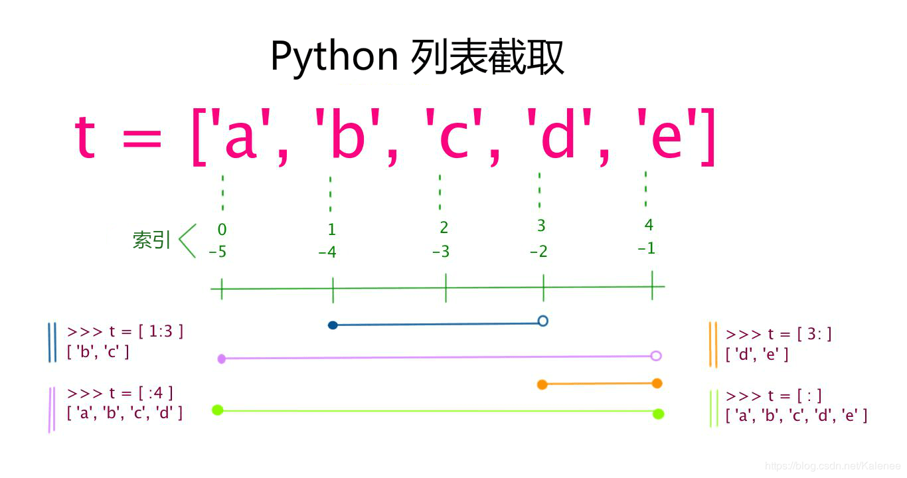

[TOC]

## 一、标准数据类型
### 1.1 不可变数据

`Number`（数字）
`String`（字符串）
`Tuple`（元组）
### 1.2 可变数据

`List`（列表）
`Set`（集合）
`Dictionary`（字典）

## 二、不可变数据
### 2.1 Number（数字）
#### 支持类型
 - `int` 
 - `float` 
 - `bool` （*在 Python2 中是没有布尔型的，它用数字 0 表示 False，用 1 表示 True。到 Python3 中，把 True 和 False 定义成关键字了，但它们的值还是 1 和 0，它们可以和数字相加，同时可以使用`and`、`or`和`not`运算。*）
 - `complex`（复数）
#### 用法简介
##### 类型判断

```python
a, b, c, d = 20, 5.5, True, 4+3j
print(type(a), type(b), type(c), type(d))
```

```
<class 'int'> <class 'float'> <class 'bool'> <class 'complex'>
```
##### 删除对象

```python
del var
```

##### 注意
 - 1、Python可以同时为多个变量赋值，如a, b = 1, 2。
 - 2、一个变量可以通过赋值指向不同类型的对象。
 - 3、数值的除法包含两个运算符：/ 返回一个浮点数，// 返回一个整数。
 - 4、在混合计算时，Python会把整型转换成为浮点数。

### 2.2 String（字符串）
Python中的字符串用单引号 ' 或双引号 " 括起来，同时使用反斜杠 \ 转义特殊字符。
字符串的截取的语法格式如下：

```
变量[头下标:尾下标]
```
索引值以 0 为开始值，-1 为从末尾的开始位置。


##### 注意
- 1、反斜杠可以用来转义，使用r可以让反斜杠不发生转义，`r'\'`会输出反斜杠(\)。
- 2、字符串可以用+运算符连接在一起，用*运算符重复。
- 3、Python中的字符串有两种索引方式，从左往右以0开始，从右往左以-1开始。
- 4、Python中的字符串不能改变。向一个索引位置赋值，比如word[0] = 'm'会导致错误。

### 2.3 Tuple（元组）
元组（tuple）与列表类似，不同之处在于元组的元素不能修改。元组写在小括号 () 里，元素之间用逗号隔开。
```python
#!/usr/bin/python3
 
tuple = ( 'abcd', 786 , 2.23, 'runoob', 70.2  )
tinytuple = (123, 'runoob')

print (tuple)             # 输出完整元组
print (tuple[0])          # 输出元组的第一个元素
print (tuple[1:3])        # 输出从第二个元素开始到第三个元素
print (tuple[2:])         # 输出从第三个元素开始的所有元素
print (tinytuple * 2)     # 输出两次元组
print (tuple + tinytuple) # 连接元组
```

虽然tuple的元素不可改变，但它可以包含可变的对象，比如`list`列表，同时包含的`list`列表为可变。
```python
>>> t = ('a', 'b', ['A', 'B'])
>>> t[2][0] = 'X'
>>> t[2][1] = 'Y'
>>> t
('a', 'b', ['X', 'Y'])
```

构造包含 0 个或 1 个元素的元组比较特殊，所以有一些额外的语法规则：
```python
tup1 = ()    # 空元组
tup2 = (20,) # 一个元素，需要在元素后添加逗号
```
##### 注意
- 1、与字符串一样，元组的元素不能修改。
- 2、元组也可以被索引和切片，方法一样。
- 3、注意构造包含0或1个元素的元组的特殊语法规则。
- 4、元组也可以使用+操作符进行拼接。

## 三、可变数据
### 3.1 List（列表）
列表可以完成大多数集合类的数据结构实现。列表中元素的类型可以不相同，它支持数字，字符串甚至可以包含列表（所谓嵌套）。
列表是写在方括号 [] 之间、用逗号分隔开的元素列表。和字符串一样，列表同样可以被索引和截取，列表被截取后返回一个包含所需元素的新列表。
```
变量[头下标:尾下标]
```


##### 基本使用
```python
len(list) 	 		   # 获取长度
append(data)  		   # 在末尾插入数据
insert(address,data)   # 在指定位置插入元素
pop(data)			   # 删除末尾数据
```
##### 注意
- 1、List写在方括号之间，元素用逗号隔开。
- 2、和字符串一样，list可以被索引和切片。
- 3、List可以使用+操作符进行拼接。
- 4、List中的元素是可以改变的。

### 3.2 Set（集合）
集合是由一个或数个形态各异的大小整体组成的，构成集合的事物或对象称作元素或是成员。
基本功能是进行成员关系测试和删除重复元素，重复元素在set中被自动过滤。
可以使用大括号`{ }`或者`set()`函数创建集合，注意：创建一个空集合必须用`set()`而不是`{ }`，因为`{ }`是用来创建一个空字典，建议一般使用`set()`，添加列表时，使用`{}`报错。
##### 基本使用
```python
add(data)		# 添加元素，已有元素，添加不会有效果
remove(data)	# 删除元素
set & set		# 交集
set | set		# 并集
```

### 3.3 Dictionary（字典）
字典（dictionary）是Python中另一个非常有用的内置数据类型，类似于map。
列表是有序的对象集合，字典是无序的对象集合。两者之间的区别在于：字典当中的元素是通过键来存取的，而不是通过偏移存取。
字典是一种映射类型，字典用` { }` 标识，它是一个无序的`键(key) : 值(value)`的集合。
键(key)必须使用不可变类型。
在同一个字典中，键(key)必须是唯一的。

##### 基本使用 
```python
d = {key1 : value1, key2 : value2 } # 创建字典
get(key,val)	# 获取key的值，若存在返回值，不存在则设置了val返回val，无设置返回None
pop(key)		# 删除key
```

##### list和dict区别
- dict
  1、查找和插入的速度极快，不会随着key的增加而变慢；
  2、需要占用大量的内存，内存浪费多。
- list
  1、查找和插入的时间随着元素的增加而增加；
  2、占用空间小，浪费内存很少。

##### 注意
- 1、字典是一种映射类型，它的元素是键值对。
- 2、字典的关键字必须为不可变类型，且不能重复。
- 3、创建空字典使用 { }。


**整理自**
[菜鸟教程](http://www.runoob.com/python3/python3-data-type.html)
[廖雪峰的官方网站](https://www.liaoxuefeng.com/wiki/0014316089557264a6b348958f449949df42a6d3a2e542c000/001431658427513eef3d9dd9f7c48599116735806328e81000)