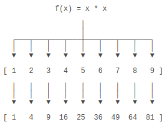

[TOC]

## 一、高阶函数

### 1.1 概述

- 变量指向函数

```python
variable = fun
```

例子

```python
>>> abs(-10)
10
>>> f = abs
>>> f
<built-in function abs>
>>> f(-10)
10
```

- 函数名作变量

```python
fun_name = variable
```

例子

```python
>>> abs = 10
```

**注意** 把`abs`指向`10`后，就无法通过`abs(-10)`调用该函数了，因为`abs`这个变量已经不指向求绝对值函数而是指向一个整数`10`，并且此处修只在当前环境生效，若想修改在其他模块生效，操作如下：

```python
import builtins
builtins.abs = 10
```

- 传入函数

高阶函数为接收另一个函数作为参数的函数。

例子

```python
def add(x, y, f):
    return f(x) + f(y)
```

```pythom
>> add(-1,-2,abs)
>> 3
```


### 1.2 map/reduce

- map

`map()`函数接收两个参数，一个是函数，一个是`Iterable`，`map`将传入的函数依次作用到序列的每个元素，并把结果作为新的`Iterator`返回。

**例子**

有一个函数$f(x)=x^2​$，要把这个函数作用在一个list `[1, 2, 3, 4, 5, 6, 7, 8, 9]`上，用`map()`实现如下：



```python
>>> def f(x):
...     return x * x
...
>>> r = map(f, [1, 2, 3, 4, 5, 6, 7, 8, 9])
>>> list(r)
[1, 4, 9, 16, 25, 36, 49, 64, 81]
```

- reduce

`reduce`把函数`f`作用在一个序列`[x1, x2, x3, ...]`上，`f`函数必须有两个参数，`reduce`把结果继续和序列的下一个元素做累积计算。

```python
reduce(f, [x1, x2, x3, x4]) = f(f(f(x1, x2), x3), x4)
```

**例子**

`str`转换为`int`的函数

```python
>>> from functools import reduce
>>> def fn(x, y):
...     return x * 10 + y
...
>>> def char2num(s):
...     digits = {'0': 0, '1': 1, '2': 2, '3': 3, '4': 4, '5': 5, '6': 6, '7': 7, '8': 8, '9': 9}
...     return digits[s]
...
>>> reduce(fn, map(char2num, '13579'))
13579
```


### 1.3 filter

`filter()`函数用于过滤序列，和`map()`类似，`filter()`也接收一个函数和一个序列。和`map()`不同的是，`filter()`把传入的函数依次作用于每个元素，然后根据返回值是`True`还是`False`决定保留还是丢弃该元素。

**例子**

删掉偶数，保留奇数

```python
def is_odd(n):
    return n % 2 == 1

list(filter(is_odd, [1, 2, 4, 5, 6, 9, 10, 15]))
# 结果: [1, 5, 9, 15]
```


### 1.4 sorted

`sorted()`函数用于对list进行排序，并且其为一个高阶函数，可接收一个`key`函数来实现自定义的排序。

- 一般排序

```python
>>> sorted([36, 5, -12, 9, -21])
[-21, -12, 5, 9, 36]
```

- 自定义排序
```python
>>> sorted([36, 5, -12, 9, -21], key=abs)
[5, 9, -12, -21, 36]
```

- 反向排序
```python
>>> sorted(['bob', 'about', 'Zoo', 'Credit'], key=str.lower, reverse=True)
['Zoo', 'Credit', 'bob', 'about']
```

**注意**　字符串排序是按照ASCII的大小比较的


## 二、返回函数

### 2.1 函数作为返回值

高阶函数除了可以接受函数作为参数外，还可以把函数作为结果值返回。

```python
def lazy_sum(*args):
    def sum():
        ax = 0
        for n in args:
            ax = ax + n
        return ax
    return sum
```

当我们调用`lazy_sum()`时，返回的并不是求和结果，而是求和函数，调用函数`f`时，才真正计算求和的结果。

```python
>>> f = lazy_sum(1, 3, 5, 7, 9)
>>> f
<function lazy_sum.<locals>.sum at 0x101c6ed90>
>>> f()
25
```

**注意**　当我们调用`lazy_sum()`时，每次调用都会返回一个新的函数，即使传入相同的参数，即调用`lazy_sum()`返回的函数之间结果互不影响。

### 2.2 闭包

类似上面的情况，当相关参数和变量都保存在返回的函数中时，这种程序结构称为`闭包（Closure）`。

**例子**

使用返回函数时，返回的函数并没有立刻执行，而是直到被调用才执行。

```python
def count():
    fs = []
    for i in range(1, 4):
        def f():
             return i*i
        fs.append(f)
    return fs

f1, f2, f3 = count()
```

输出

```python
>>> f1()
9
>>> f2()
9
>>> f3()
9
```

**注意**　返回闭包时牢记一点：返回函数不要引用任何循环变量，或者后续会发生变化的变量。


## 三、匿名函数

匿名函数为不显式地定义函数，常用于传入函数，关键字为`lambda`。匿名函数定义时只能有一个表达式，不用写`return`，返回值就是该表达式的结果。

**例子**

```python
>>> list(map(lambda x: x * x, [1, 2, 3, 4, 5, 6, 7, 8, 9]))
[1, 4, 9, 16, 25, 36, 49, 64, 81]
```

其中匿名函数`lambda x: x * x`实际如下，冒号前面的`x`表示函数参数。

```python
def f(x):
    return x * x
```


## 四、装饰器

“装饰器”（Decorator）为在代码运行期间动态增加功能的方式。

**例子**

定义一个能打印日志的decorator

```python
def log(func):
    def wrapper(*args, **kw):
        print('call %s():' % func.__name__)
        return func(*args, **kw)
    return wrapper
```

观察上面的`log`，因为它是一个decorator，所以接受一个函数作为参数，并返回一个函数。我们要借助Python的@语法，把decorator置于函数的定义处

```python
@log
def now():
    print('2015-3-25')
```

调用`now()`函数，不仅会运行`now()`函数本身，还会在运行`now()`函数前打印一行日志：

```python
>>> now()
call now():
2015-3-25
```

把`@log`放到`now()`函数的定义处，相当于执行了语句：

```python
now = log(now)
```

由于`log()`是一个decorator，返回一个函数，所以，原来的`now()`函数仍然存在，只是现在同名的`now`变量指向了新的函数，于是调用`now()`将执行新函数，即在`log()`函数中返回的`wrapper()`函数。

`wrapper()`函数的参数定义是`(*args, **kw)`，因此，`wrapper()`函数可以接受任意参数的调用。在`wrapper()`函数内，首先打印日志，再紧接着调用原始函数。


## 五、偏函数

`functools.partial`的作用就是，把一个函数的某些参数给固定住（也就是设置默认值），返回一个新的函数。

**例子**

`int()`函数可以把字符串转换为整数，其提供额外的`base`参数，默认值为`10`，如果传入`base`参数，就可以做N进制的转换。

```python
>>> int('12345')
12345
>>> int('12345', base=8)
5349
```

若需固定`base`参数，定义一个转换到指定进制的新函数，可使用偏函数。
```python
>>> import functools
>>> int2 = functools.partial(int, base=2)
>>> int2('1000000')
64
>>> int2('1010101')
85
```


## 参考

[廖雪峰](https://www.liaoxuefeng.com/wiki/0014316089557264a6b348958f449949df42a6d3a2e542c000/0014317568446245b3e1c8837414168bcd2d485e553779e000)